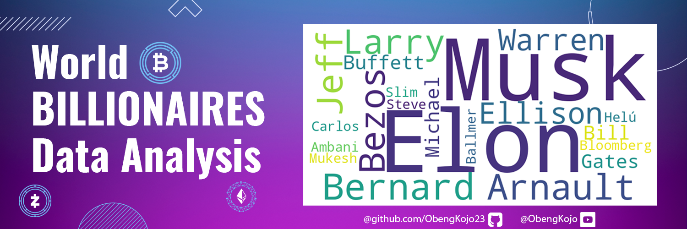
# World’s Billionaires Data Analysis


<a id="cont"></a>
 
## **Project Structure**

<a href=#one>1. Introduction</a>

<a href=#two>2. Data Processing & Preparation</a>

<a href=#three>3. Visualisation of Results</a>

<a href=#four>4. Conclusion</a>

<a href=#five>5. Project Details</a>

---

 <a id="one"></a>
## **🌍 1. Introduction**
<a href=#cont>Back to Project Structure</a>

### 1.1 Project Overview 📝
This project aims to explore various aspects of the global billionaire population using a dataset of billionaires, including their demographic details, wealth, and geographical distribution. The focus is on understanding how factors such as gender, age, region, and wealth type correlate with the concentration of billionaires worldwide. Additional insights include trends in self-made versus inherited wealth, birth month distributions, and the relationship between economic indicators and the number of billionaires in a country.


### 1.2 Objective 🎯

To deliver a data-driven analysis that uncovers patterns and trends in global wealth distribution among billionaires. The objective is to identify key characteristics that distinguish self-made versus inherited wealth, understand how demographics and economic indicators correlate with billionaire populations, and examine the factors contributing to the concentration of wealth in certain regions and industries. This project aims to offer actionable insights into the global wealth landscape and the forces shaping it by answering these underlisted 17 questions.

1. *What is the distribution of billionaires by gender?*
2. *How is wealth distributed among self-made billionaires compared to those who inherited their wealth?*
3. *Which countries and cities have the highest concentration of billionaires?*
4. *What is the age distribution of billionaires?*
5. *Which industries do most billionaires belong to?*
6. *What are the most common sources of wealth for billionaires?*
7. *How is the net worth of billionaires distributed globally?*
8. *What percentage of billionaires are self-made versus inherited?*
9. *How does the billionaire population correlate with economic indicators such as GDP and CPI?*
10. *Is there a relationship between population size and the number of billionaires in a country?*
11. *How does the age of billionaires correlate with their net worth?*
12. *Which countries have the highest number of self-made billionaires?*
13. *What is the distribution of billionaires by birth month?*
14. *Is there a noticeable difference in the number of billionaires by gender in different industries?*
15. *Which organizations or companies are most frequently associated with billionaires?*
16. *What trends can be observed in the wealth accumulation of younger versus older billionaires?*
17. *How has the number of billionaires evolved over time, particularly in key industries?*

### 1.3 Dataset Summary 💾
The dataset used in this project contains comprehensive information about billionaires. The data was sourced from [kaggle]([https://www.forbes.com/billionaires/](https://www.kaggle.com/datasets/nelgiriyewithana/billionaires-statistics-dataset)). Below is a table of the data summary.

| Column    | Description                                                      |
|-----------|------------------------------------------------------------------|
| `rank`: | The ranking of the billionaire in terms of wealth. |
| `finalWorth`: | The final net worth of the billionaire in U.S dollars. |
| `category`: | The category or industry in which the billionaire's business operates. |
| `personName`: | The full name of the billionaire. |
| `age`: | The age of the billionaire. |
| `country`: | The country in which the billionaire resides. |
| `city`: | The city in which the billionaire resides. |
| `source`: | The source of the billionaire's wealth. |
| `industries`: | The industries associated with the billionaire's business interests. |
| `countryOfCitizenship`: | The country of citizenship of the billionaire. |
| `organization`: | The name of the organization or company associated with the billionaire. |
| `selfMade`: | Indicates whether the billionaire is self-made (True/False). |
| `status`: | "D" represents self-made billionaires (Founders/Entrepreneurs) and "U" indicates inherited or unearned wealth. |
| `gender`: | The gender of the billionaire. |
| `birthDate`: | The birthdate of the billionaire. |
| `lastName`: | The last name of the billionaire. |
| `firstName`: | The first name of the billionaire. |
| `title`: | The title or honorific of the billionaire. |
| `date`: | The date of data collection. |
| `state`: | The state in which the billionaire resides. |
| `residenceStateRegion`: | The region or state of residence of the billionaire. |
| `birthYear`: | The birth year of the billionaire. |
| `birthMonth`: | The birth month of the billionaire. |
| `birthDay`: | The birth day of the billionaire. |
| `cpi_country`: | Consumer Price Index (CPI) for the billionaire's country. |
| `cpi_change_country`: | CPI change for the billionaire's country. |
| `gdp_country`: | Gross Domestic Product (GDP) for the billionaire's country. |
| `gross_tertiary_education_enrollment`: | Enrollment in tertiary education in the billionaire's country. |
| `gross_primary_education_enrollment_country`: | Enrollment in primary education in the billionaire's country. |
| `life_expectancy_country`: | Life expectancy in the billionaire's country. |
| `tax_revenue_country_country`: | Tax revenue in the billionaire's country. |
| `total_tax_rate_country`: | Total tax rate in the billionaire's country. |
| `population_country`: | Population of the billionaire's country. |
| `latitude_country`: | Latitude coordinate of the billionaire's country. |
| `longitude_country`: | Longitude coordinate of the billionaire's country. |

---

 <a id="two"></a>
## **🔄 2. Data Processing and Preparation**
<a href=#cont>Back to Project Structure</a>

For the data processing and preparation for this project I employed several steps to ensure consistency, accuracy, and usability of the dataset. Here’s a summary of the transformations I applied:

- **Column Formatting**:
   - All column names were standardized to lowercase, and spaces were replaced with underscores for easier access and consistency.

- **Data Type Conversion**:
   - The `gdp_country` column had dollar signs (`$`) and commas removed, and the data type was converted to `float` to support numerical analysis.
   - Similarly, the `finalworth` column had the dollar sign and "B" (billion) symbol removed and was converted to a float, assuming figures are in billions.

- **Date Formatting**:
   - The `date` column was converted to a datetime format and displayed as `MM/DD/YYYY` for consistency in date representation.

- **Column Renaming**:
   - Key columns were renamed for clarity and consistency, such as changing `personname` to `full_name` and `countryofcitizenship` to `country_of_citizenship`.


- **Month Conversion**:
   - A dictionary was created to convert numeric month values (1 to 12) to their corresponding three-letter month abbreviations (e.g., `1` to `Jan`). This was applied to the `birth_month` column to improve readability.

- **Handling Missing Values**:
   - For specified columns (`country`, `title`, `organization`, `residence_state_region`, `state`), missing values were filled with "Unknown" to avoid issues with null data during analysis and to maintain data completeness.

- **Region Mapping**:
   - A dictionary was created to map each country to its respective region (e.g., `France` to `Europe`, `India` to `Asia`). A new column, `region`, was added based on the `country_of_citizenship` column, providing a broader regional context for each billionaire's country.

These data cleaning steps resulted in a well-structured dataset ready for full analysis and visualisation.

---

 <a id="three"></a>
## **📊 3. Visualisation of Results**
<a href=#cont>Back to Project Structure</a>

### 3.1 Who is the wealthiest person on the planet as at August 2023❓
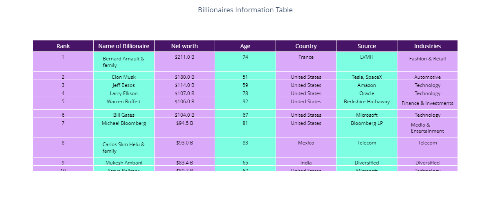

#### 🌟Key Insights
- `Bernard Arnaukt` a `74` year old man from France who happens to be the CEO of `LVMH` is the wealthiest person on earth.
- He is worth a staggering `$211 B`
- `LVMH Moët Hennessy Louis Vuitton`, commonly referred to as `LVMH`, is a French multinational corporation and conglomerate headquartered in Paris. It is known for being one of the world's largest luxury goods companies, encompassing a wide range of sectors, including:

   - `Fashion and Leather Goods`: Louis Vuitton, Dior, Fendi, Celine, Givenchy, and Loewe.
   - `Wines and Spirits`: Moët & Chandon, Hennessy, Dom Pérignon, Veuve Clicquot, and Glenmorangie.
   - `Perfumes and Cosmetics`: Christian Dior Parfums, Givenchy Beauty, and Benefit Cosmetics.
   - `Watch and Jewelry`: TAG Heuer, Bulgari, and Hublot.

- **Financial Performance**: The company has demonstrated strong financial performance, with substantial revenues generated from its diverse portfolio of luxury brands. It often reports double-digit growth rates, particularly in emerging markets.

- **Sustainability**: LVMH has made commitments to sustainability and responsible business practices, focusing on environmental impact and social responsibility.

- **Cultural Influence**: The company is heavily involved in arts and culture, sponsoring events and exhibitions, and supporting creativity through initiatives like the LVMH Prize for Young Fashion Designers.
  
---
### 3.2 What is the distribution of billionaires by country❓
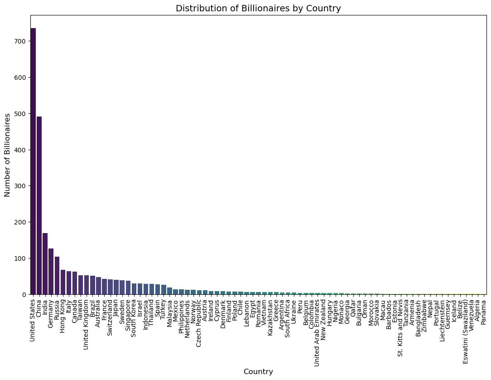
####  🌟Key Insights
- The `United States` leads significantly in the number of billionaires, indicating a strong concentration of wealth and entrepreneurial success.
- Other countries with notable billionaire counts include `China`, `India`, and `Germany`, reflecting diverse economic landscapes and opportunities for wealth generation.
- Several countries have relatively few billionaires, suggesting economic challenges or less favorable environments for wealth accumulation.

These findings highlight the global disparities in wealth concentration among billionaires and the economic conditions influencing these distributions.

---
### 3.3 What is the distribution of billionaires by region❓
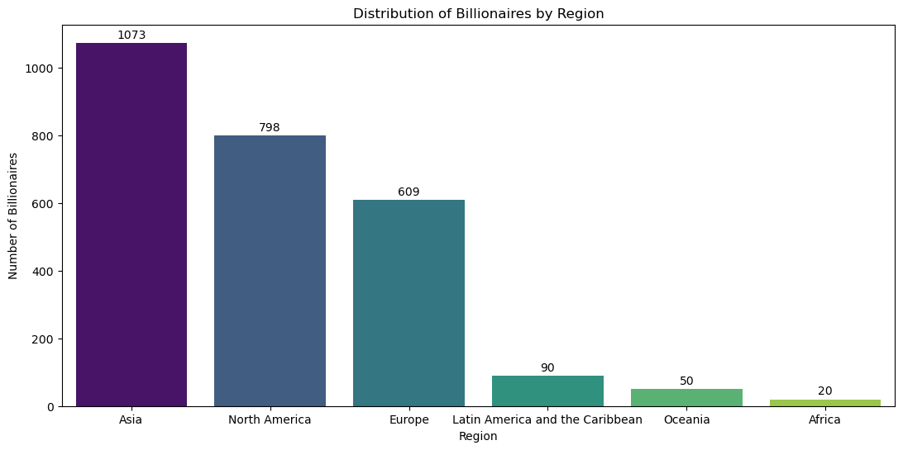
####  🌟Key Insights
- `Asia` has the highest concentration of billionaires, driven primarily by `China and India`, reflecting its robust economy and entrepreneurial environment.
- `North America` follows closely, driven primarily by `USA`, showcasing rapid economic growth and wealth creation in the region.
- `Europe`, while home to many billionaires, shows a lower count compared to the leading regions, indicating varying levels of wealth accumulation and economic conditions.
- Other regions, such as `Latin America and the Caribbean`, `Oceania` and `Africa`, have significantly fewer billionaires, highlighting economic challenges and opportunities for growth.

These findings emphasize the geographical disparities in billionaire wealth and the economic factors contributing to these distributions.

---
### 3.4 What is the gender distribution among billionaires globally❓
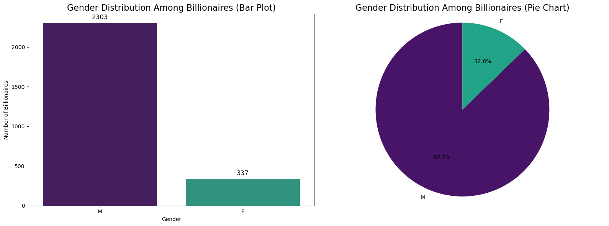
####  🌟Key Insights
- The `bar chart` clearly shows that there are significantly more male billionaires `(2303)` compared to female billionaires `(337)`, reflecting the ongoing gender disparities in wealth accumulation and business leadership.
- The `pie chart` reinforces this observation, illustrating the percentage share of each gender. The majority `(87.2%)` of billionaires are male, while females represent a smaller proportion `(12.8%)` of the billionaire population.
- These findings highlight the need for continued efforts to promote gender equality and empower women in business and entrepreneurship to bridge the wealth gap.

---
### 3.5 How do the numbers of male and female billionaires vary across different industries❓
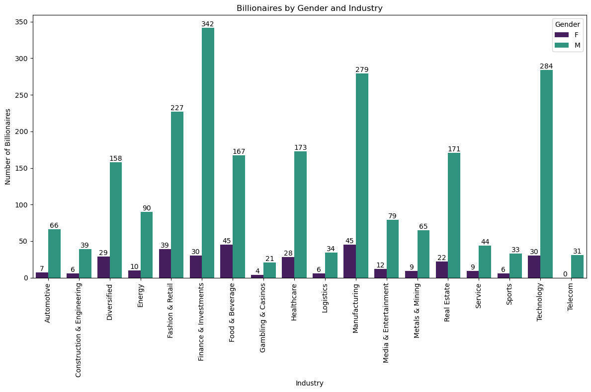
####  🌟Key Insights
- **Gender Disparity**: The data reveals a significant gender disparity, with male billionaires outnumbering female billionaires in all industries. A key observation is that there is `no` female billionaire in the Telecom industry. This highlights the ongoing challenges women face in achieving equal representation and success in wealth accumulation.
- **Call to Action**: The visualization underscores the importance of fostering diversity and inclusion within industries, emphasizing the need for policies and initiatives aimed at empowering women in business and leadership roles.

---
### 3.6 How does age correlate with net worth among billionaires❓
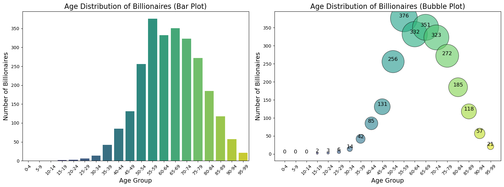
####  🌟Key Insights
- **Peak Billionaire Age Groups**: The highest number of billionaires falls within the `55-59` age group `(376 billionaires)`, followed by the `60-64` group `(351 billionaires)`. This indicates that most billionaires are in their late middle age.

- **Gradual Decline in Older Age Groups**: After the age of `65`, the number of billionaires starts to decline gradually, but the `65-79` age groups still show relatively high numbers, suggesting many billionaires remain wealthy and active during older age.

- **Low Representation Among Younger Individuals**: There are very few billionaires below the age of `40`, with the `15-19`,  `20-24` and `25-29` age groups having just `2`, `3` and `6` billionaires respectively.

- **Longevity of Wealth**: Even in the older age groups, such as `90-94` and `95-99`, a small number of billionaires still exist, showing that wealth can persist into advanced age.

Overall, billionaires are more likely to be found in the `45-79` age range, reflecting that substantial wealth accumulation takes time and typically peaks in late middle age.

---
### 3.7 What industries or sectors have the highest concentration of billionaires❓
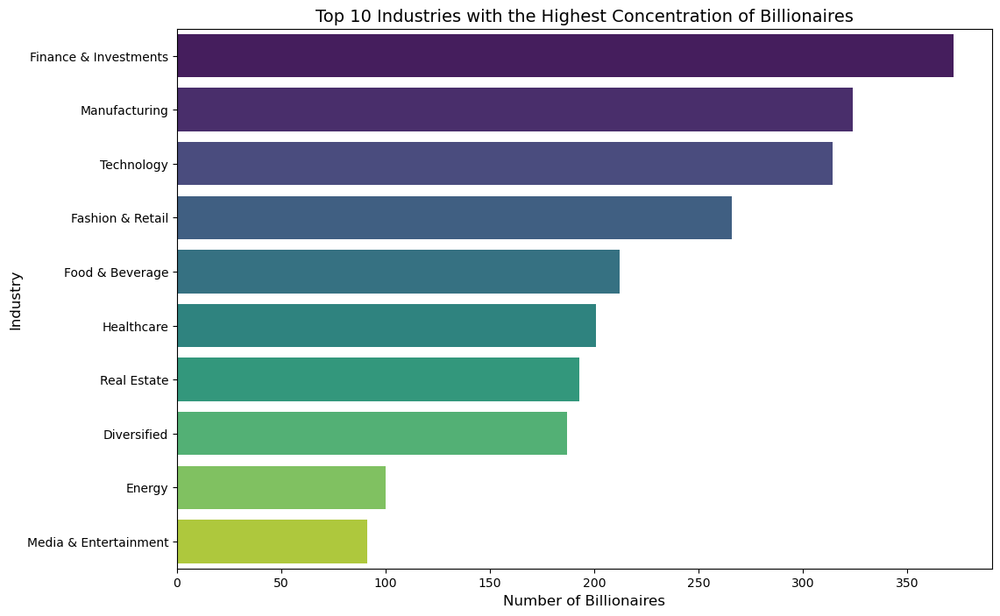
####  🌟Key Insights
- **Leading Industries**: The  `finance & investments` sector emerges as the industry with the highest concentration of billionaires, followed by `manufacturing` and `Technology`. This reflects the significant wealth creation potential within these sectors.
- **Diversity of Wealth Sources**: Industries such as `retail & fashion`, `food & beverages` and `healthcare` also feature prominently, indicating diverse avenues for wealth accumulation beyond technology and finance.
- **Economic Insights**: The data suggests that certain industries are more conducive to billionaire wealth, highlighting potential areas for investment and economic growth.
- **Implications for Policy**: Understanding the industries that generate significant wealth can inform policymakers and economic planners in fostering environments that support entrepreneurial growth and innovation.

---
### 3.8 What percentage of billionaires are self-made versus inherited wealth❓
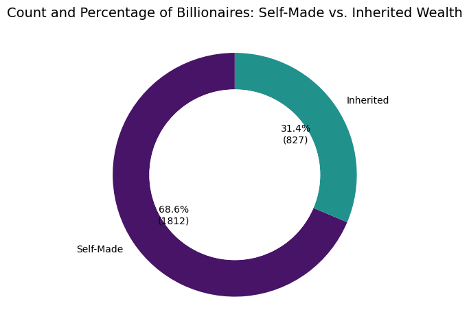
####  🌟Key Insights

- **Self-Made Billionaires**: 
  - Count: `1,812`
  - Percentage: `68.6%`
  - Observation: A significant majority of billionaires are classified as self-made, indicating a strong trend of wealth creation through entrepreneurship and innovation.

- **Inherited Billionaires**: 
  - Count: `827`
  - Percentage: `31.4%`
  - Observation: Inherited wealth accounts for a smaller portion of the billionaire population, suggesting that while family wealth still plays a role, the environment is increasingly favorable for self-made individuals.

The data highlights the predominance of self-made billionaires in the current economic landscape, reflecting a culture that supports entrepreneurship and personal achievement.

---
### 3.9 Which industries have the highest concentration of billionaires, and how does their average net worth vary across these industries❓
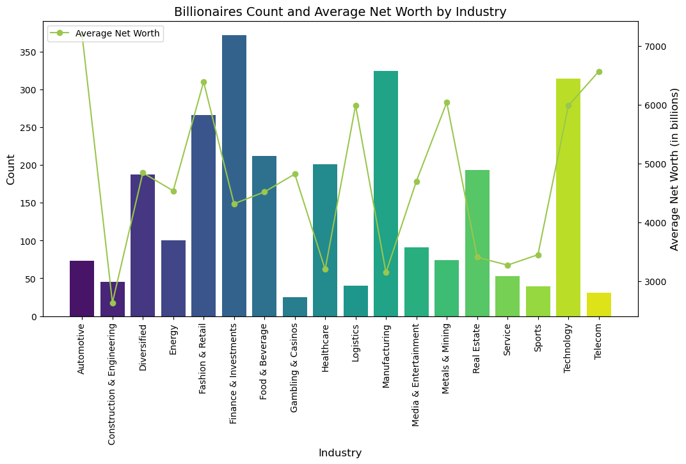
####  🌟Key Insights
- **Industry Distribution**: Certain industries, like `technology` and `finance`, have the highest number of billionaires, indicating lucrative opportunities in these sectors.

- **Wealth Concentration**: The average net worth of billionaires varies by industry, with `technology` often showing higher average wealth compared to others.

- **Investment Insights**: The analysis highlights potential investment opportunities in sectors with high counts and average net worth, guiding strategic economic decisions.

--- 
### 3.10 How many billionaires are there in total and what is their total wealth❓

####  🌟Key Insights
- **Total Number of Billionaires**: 
   - The total number of billionaires in the dataset is `2,640`.

- **Total Wealth of Billionaires**: 
   - The combined total wealth of these billionaires is approximately `$12.21 trillion`.

---
### 3.11 Which city is the most preferred residence for billionaires❓
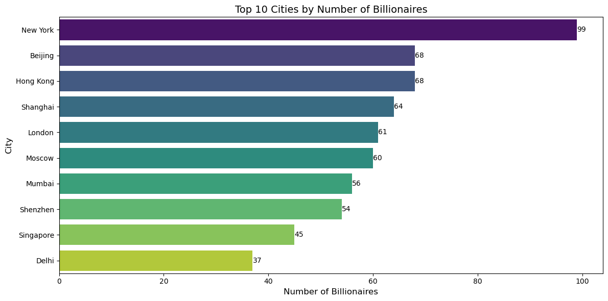
####  🌟Key Insights
- **Leading Cities**: `New York`, `Beijing`, `Hong Kong`, `Shanghai`, `London` and `Moscow` dominate the list, indicating their status as global financial and economic hubs.
- **Geographical Concentration**: The data highlights the concentration of billionaires in metropolitan areas, emphasizing the correlation between urban environments and wealth accumulation.
- **Economic Dynamics**: The presence of numerous billionaires in these cities suggests vibrant economies, robust business infrastructures, and opportunities for innovation and investment.
- **Implications for Urban Planning**: Understanding the wealth distribution across cities can help policymakers focus on fostering environments that attract and retain wealthy individuals and entrepreneurs.

---
### 3.12 In what month are most billionaires born❓
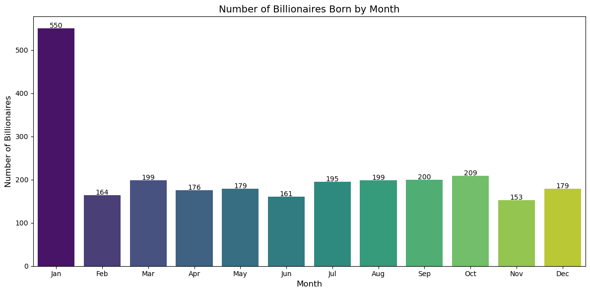
####  🌟Key Insights
- **Peak Birth Months**: `January` has the highest number `(550)` of billionaires and is more than twice the nearest month. Certain months, such as `October`, `September`, `March` and `July` show a higher concentration of billionaire births. Does this suggests any potential seasonal or astrological influences on wealth accumulation?
- **Lower Birth Months**: `November`, had the least number `(153)` of billionaires followed closely by `Febraury` and `June `. 
- Generally, aside `January` wealth seems to be fairly distributed
- **Implications for Wealth Trends**: Understanding the birth month distribution of billionaires can provide insights into the socio-economic conditions and opportunities that may influence successful outcomes in these months.

---
### 3.13 In what day of the week are most billionaires born❓
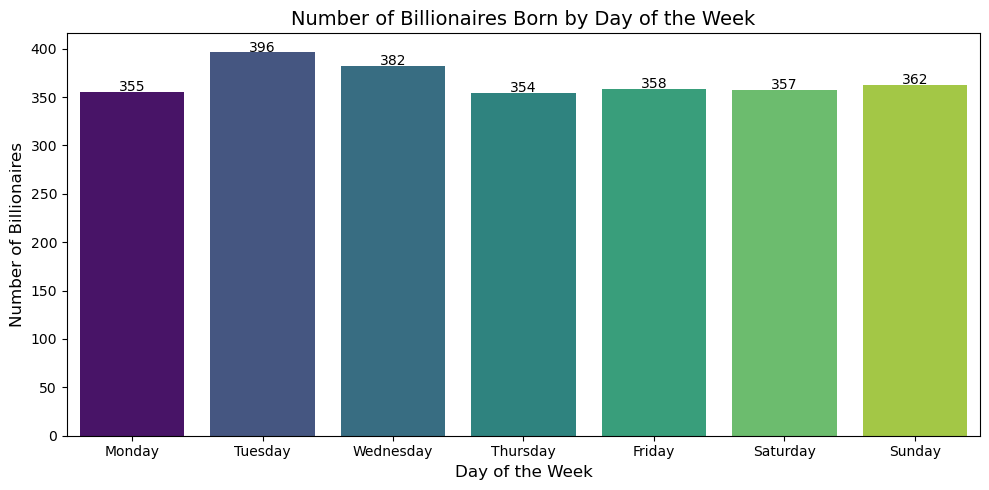
####  🌟Key Insights
- **Peak Birth Day**: The data indicates that most billionaires are born on Tuesdays `(396)`.
- **Lower Birth Day**: Thursday had the least billionaires `(354)` .
- **Implications for Wealth Trends**: The distribution of billionaire births by day of the week is fairly distributed. Anyone can therefore, be a billionaire if he or she puts in the hard work.

---
### 3.14 In what day of the month are most billionaires born❓
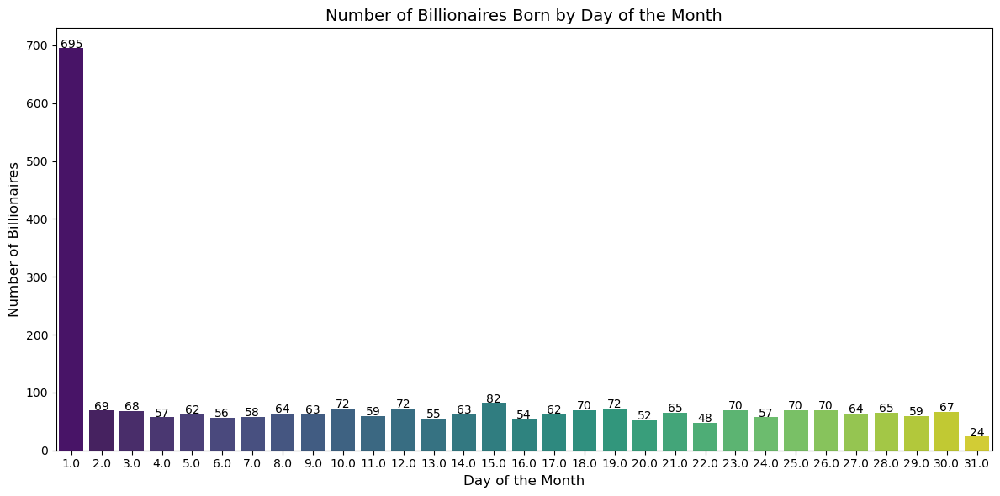
####  🌟Key Insights

**Birth Date Distribution**:
   - The highest number of billionaires are born on the `1st` of the month, with a total of `695 billionaires`.
   - Conversely, the `31st` day has the least number of billionaires, with only `24 billionaires` born.
   - The distribution for the remaining days of the month varies between `54` and `72 billionaires`.

**Possible Reasons for highest number on the 1st and lowest on the 31st**

- **Higher Births on the 1st**:
  - **Cultural and Societal Factors**: The 1st of the month may have cultural significance in many societies, often associated with new beginnings, making it a popular time for families to welcome new children. The notion of starting fresh with the month can also lead to increased emotional and psychological motivations for families to conceive and give birth around this time.
  - **Planned Births**: Many parents may intentionally plan for their child's birth to occur at the beginning of the month, especially if they desire their child to start school at the beginning of the academic year or have a birthday that aligns with the start of the month.
  - **Medical Scheduling**: Hospitals might have scheduling patterns that favor elective births (like induced labor or C-sections) at the beginning of the month, particularly for financial reasons, such as meeting insurance or payment cycles.
  
- **Lower Births on the 31st**:
  - **Fewer Days in the Month**: The 31st day occurs less frequently in the year than other days, as not every month has 31 days. This naturally results in fewer birthdays on this date.
  - **Statistical Anomaly**: The 31st may also be subject to statistical anomalies, where it could be a day less favored for scheduling births, leading to a lower count compared to other days.

---
### 3.15 What regions have the highest concentration of young billionaires❓
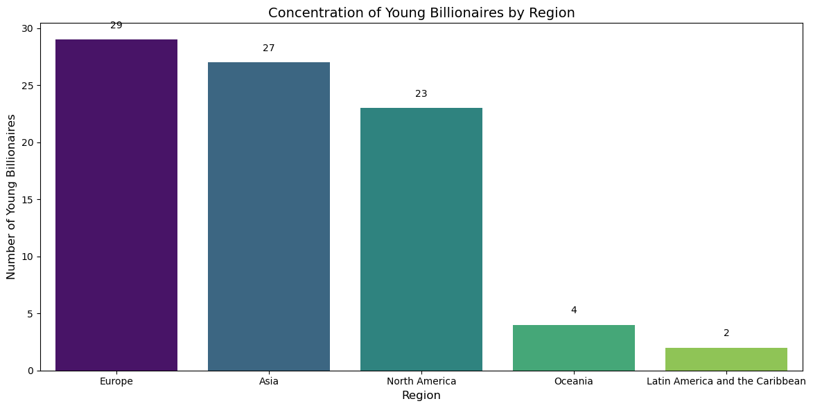
####  🌟Key Insights
- **Leading Regions**: Europe leads with `29 young billionaires`, followed closely by Asia with `27`. North America also has a notable presence, with `23 young billionaires`.
- **Emerging Markets**: Oceania and Latin America & the Caribbean show a smaller number, with `4 and 2 young billionaires` respectively, indicating potential growth areas for young wealth creators in these regions.
- **Absence in Africa**: Notably, there are `no young billionaires` in Africa, suggesting a significant gap in youth wealth accumulation compared to other regions.
- **Implications**: These trends may reflect differences in economic opportunities, educational access, and entrepreneurial ecosystems across regions, providing insights for policymakers and investors looking to support young wealth creators.

---
### 3.16 Is there a correlation between a country’s economic indicator, Consumer Price Index (CPI) and the number of billionaires it has❓
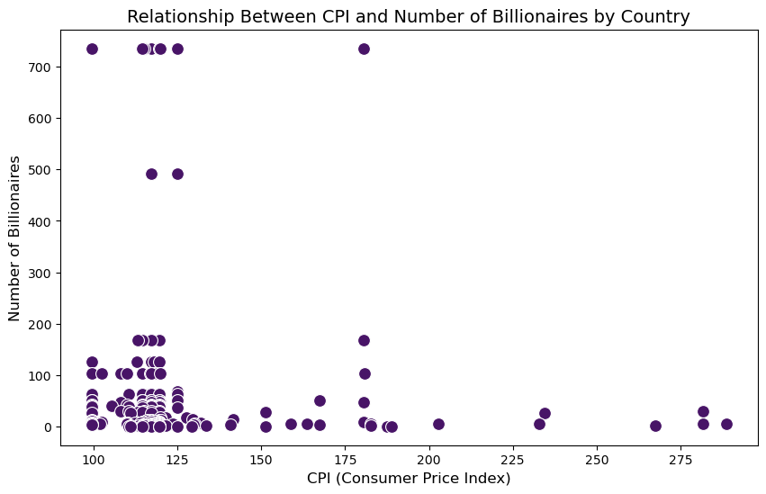

#### 🌟Key Insights
- **Weak Negative Correlation**: The correlation coefficient of `-0.05` indicates a very weak negative relationship between CPI and the number of billionaires, suggesting that changes in CPI do not strongly predict the number of billionaires in a country.
- **P-Value Insights**: The p-value of `0.48231` indicates that the observed correlation is not statistically significant, implying that there is no meaningful relationship between CPI and billionaire count in this dataset.
- **Implications**: These findings suggest that factors other than CPI may play a more significant role in the accumulation of wealth and the presence of billionaires in a country, such as economic policies, investment climate, or social conditions.
  
.
---
### 3.17 Is there a correlation between a country’s economic indicator, Gross Domestic Product (GDP) and the number of billionaires it has❓
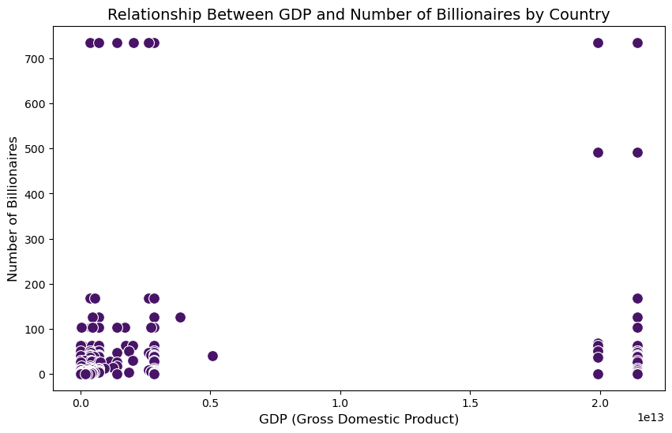

####  🌟Key Insights
- **Positive Correlation**: The correlation coefficient of `0.15` indicates a weak positive relationship between GDP and the number of billionaires. This suggests that, as GDP increases, the number of billionaires tends to rise, albeit the relationship is not strong.
- **Statistical Significance**: The p-value of `0.03962` indicates that the correlation is statistically significant at the 5% level, implying that there is a meaningful association between GDP and the billionaire count.
- **Economic Implications**: These findings suggest that countries with larger economies (higher GDP) are likely to have more billionaires, highlighting the influence of economic prosperity on wealth accumulation. However, the weak correlation indicates that GDP alone is not a definitive predictor of billionaire presence, and other factors may also be at play.

---

 <a id="four"></a>
## **🔚 4. Conclusion & Summary**
<a href=#cont>Back to Project Structure</a>

### 4.1 Conclusion ✅
The analysis provides a comprehensive look at the world's billionaire population and the various factors influencing wealth creation and distribution. By correlating socioeconomic factors with billionaire presence, this project sheds light on how wealth is amassed and maintained globally.

### 4.2 Summary 💡
The analysis of the world's billionaires dataset involved examining key metrics such as net worth, industries, geographical distribution, and the age of billionaires. The key findings include:
- **Wealth Distribution**: Analysis of net worth reveals significant disparities between self-made and inherited billionaires.
- **Geographic Focus**:  Wealth is highly concentrated in certain countries, cities, and industries, with the United States and China, as well as sectors like technology and finance, leading in billionaire density.
- **Demographics**: Trends in gender and age distribution show that most billionaires fall within specific age brackets, and self-made wealth is more common among younger billionaires.

 ---


 <a id="four"></a>
## **📁 5. Project Details**
<a href=#cont>Back to Project Structur</a>

------
### 5.1 Technologies Used 🛠 

- **Python**: Data manipulation and analysis
- **Pandas**: For data manipulation
- **Matplotlib & Seaborn**: For data visualization
- **Plotly**: For interactive visualizations
- **Scipy**: For statistical analysis
- **Jupyter Notebook**: For organizing the analysis and documentation 
- **Photoshop**: For Graphic designing
- **Git/GitHub:** Used as my version control tool to manage and document my project changes and sharing of findings. 

---
### 5.2 Skills Employed 🧠 
- **Python Programming for Data Analysis:** Utilized Python libraries such as `pandas`, `numpy`, and `matplotlib` for data manipulation, statistical analysis, and visualization.
- **Data Cleaning and Preprocessing:** Employed techniques to handle missing values, formatting columns and converting data types.
- **Exploratory Data Analysis (EDA):** Conducted in-depth analysis to explore data distributions, identify trends, and uncover patterns in billionaire wealth, age, and sector.
- **Data Visualization:** Created visualizations (bar charts, pie chart, scatter plots, bubble plots) using `seaborn`, `plotly` and `matplotlib` to represent trends, distributions, and relationships in the data.
- **Statistical Analysis:** Applied descriptive statistics and correlation analysis to understand the data’s underlying patterns.
- **Feature Engineering:** Created new features to enhance the analysis of billionaires' characteristics.
- **Project Documentation:** Documented all Python codes, analysis steps, and findings to ensure reproducibility and clarity for future reference.


## 5.3 How to Run This Project 🚀 

1. **Clone the Repository**  
   Run the following command to clone the repository to your local machine:
   ```bash
   git clone https://github.com/ObengKojo23/world-billionaires-analysis.git
2. **Install Dependencies**  
   Install the required Python packages by running:
   ```bash
   pip install -r requirements.txt
3. **Run the Jupyter Notebook**  
   Start Jupyter Notebook and run the `billionaires-data-analysis-2023.ipynb` file to reproduce the analysis. Use the following command to launch Jupyter:
   Make sure that you have the dataset and the jupyter notebook file in the directory else you may have to change the read csv path in the notebook provided.
   ```bash
   jupyter notebook
---


Contributing
Contributions are welcome! If you have suggestions or improvements, please create a pull request or open an issue.
### 5.4 References
1. The Billionaires Database was sourced from [kaggle.com](https://www.kaggle.com/datasets/nelgiriyewithana/billionaires-statistics-dataset)
2. Original Banner image sourced from [freepik.com](https://www.freepik.com) and redesigned by me `(ObengKojo)`.


## Contact

For any questions or suggestions, feel free to reach out:

- **Email**: emmanuel.o.afari@gmail.com
- **LinkedIn**: [LinkedIn Page](https://www.linkedin.com/in/obengafari)
- **GitHub**: [GitHub page](https://github.com/ObengKojo23)
- **YouTube**: [YouTube tutorials](https://youtube.com/obengkojo)

---


